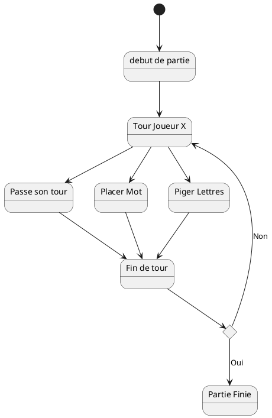
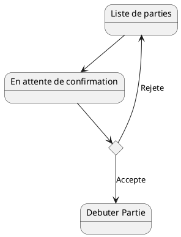

# Deroulement de Partie



# Joindre Partie



# Classes pour une partie de Scrabble Classique

```plantuml
class Joueur{
	string Nom
	char[7] Chevalet
	int Score
	+Jouer()
	-Piger()
	-PlacerMot()
	-PasserSonTour()
}
class PartieMultijoueur{
	Joueur[2] Joueurs
	Plateau Plateau
	int JoueurActif
	+EffectuerTour()
	-VerifierFin()
}
@enduml
```
