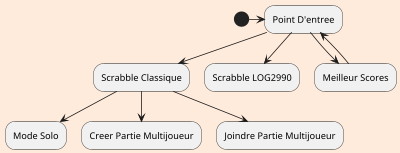
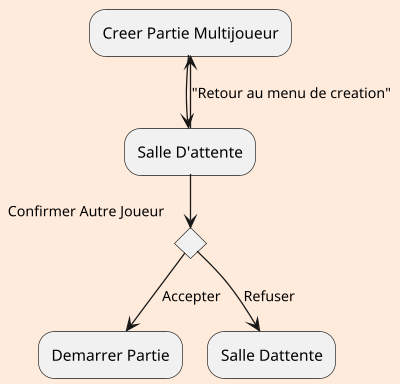
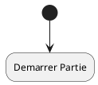

## Diagramme d'état du client

###Point D'entree

```plantuml
@startuml
scale 400 width
skinparam backgroundColor #FFEBDC
(*) -> "Point D'entree"
"Point D'entree" --> "Scrabble Classique"
"Point D'entree" --> "Scrabble LOG2990"
"Point D'entree" --> "Meilleur Scores"
"Meilleur Scores" --> "Point D'entree"
"Scrabble Classique" --> "Mode Solo"
"Scrabble Classique" --> "Creer Partie Multijoueur"
"Scrabble Classique" --> "Joindre Partie Multijoueur"
@enduml
```

###Scrabble Classique

```plantuml
@startuml
scale 400 width
skinparam backgroundColor #FFEBDC


"Creer Partie Multijoueur" --> "Salle D'attente"
if "Confirmer Autre Joueur" then
--> [Accepter] "Demarrer Partie"
else
--> [Refuser] "Salle Dattente"
endif

"Salle D'attente" --> ["Retour au menu de creation"] "Creer Partie Multijoueur"

@enduml
```

###Demarer Partie

```plantuml
@startuml
(*) --> Demarrer Partie

@enduml
```
