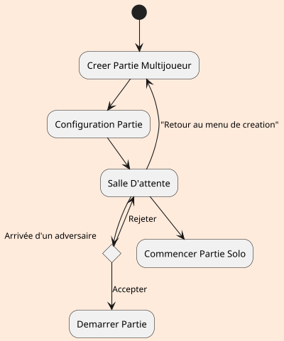

## Créer Partie Multijoueur

```plantuml
@startuml
scale 400 width
skinparam backgroundColor #FFEBDC

(*) --> "Creer Partie Multijoueur"
"Creer Partie Multijoueur" --> "Configuration Partie"
"Configuration Partie"--> "Salle D'attente"


if "Arrivée d'un adversaire" then
--> [Accepter] "Demarrer Partie"
else
--> [Rejeter] "Salle D'attente"
endif
"Salle D'attente" --> "Commencer Partie Solo"
"Salle D'attente" --> ["Retour au menu de creation"] "Creer Partie Multijoueur"

@enduml
```
