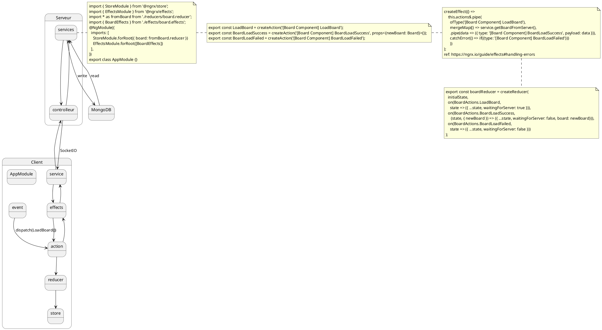

```plantuml
@startuml

state Client{
    state service
    state reducer
    state effects
    state action
    state store
    state event
    state AppModule
}

state Serveur{
    state controlleur
    state services
}

state AppModule
    note right
import { StoreModule } from '@ngrx/store';
import { EffectsModule } from '@ngrx/effects';
import * as fromBoard from './reducers/board.reducer';
import { BoardEffects } from './effects/board.effects';
@NgModule({
  imports: [
    StoreModule.forRoot({ board: fromBoard.reducer })
    EffectsModule.forRoot([BoardEffects])
  ],
})
export class AppModule {}
    end note

event --> action: dispatch(LoadBoard())
note right
export const LoadBoard = createAction('[Board Component] LoadBoard');
export const BoardLoadSuccess = createAction('[Board Component] BoardLoadSuccess', props<{newBoard: Board}>());
export const BoardLoadFailed = createAction('[Board Component] BoardLoadFailed');
end note
action --> effects
note right
createEffect(() =>
    this.actions$.pipe(
      ofType('[Board Component] LoadBoard'),
      mergeMap(() => service.getBoardFromServer(),
      .pipe(data => ({ type: '[Board Component] BoardLoadSuccess', payload: data })),
      catchError(() => if({type: '[Board Component] BoardLoadFailed'}))
      ))
);
ref: https://ngrx.io/guide/effects#handling-errors
end note
effects --> service
service --> effects
effects --> action
action --> reducer
note bottom
export const boardReducer = createReducer(
  initialState,
  on(BoardActions.LoadBoard,
    state => ({ ...state, waitingForServer: true })),
  on(BoardActions.BoardLoadSuccess,
     (state, { newBoard }) => ({ ...state, waitingForServer: false, board: newBoard})),
  on(BoardActions.BoardLoadFailed,
    state => ({ ...state, waitingForServer: false }))
);
end note
reducer --> store

service --> controlleur
controlleur --> service: SocketIO
services --> controlleur
controlleur --> services
services --> MongoDB: write
MongoDB --> services: read


@enduml
```
